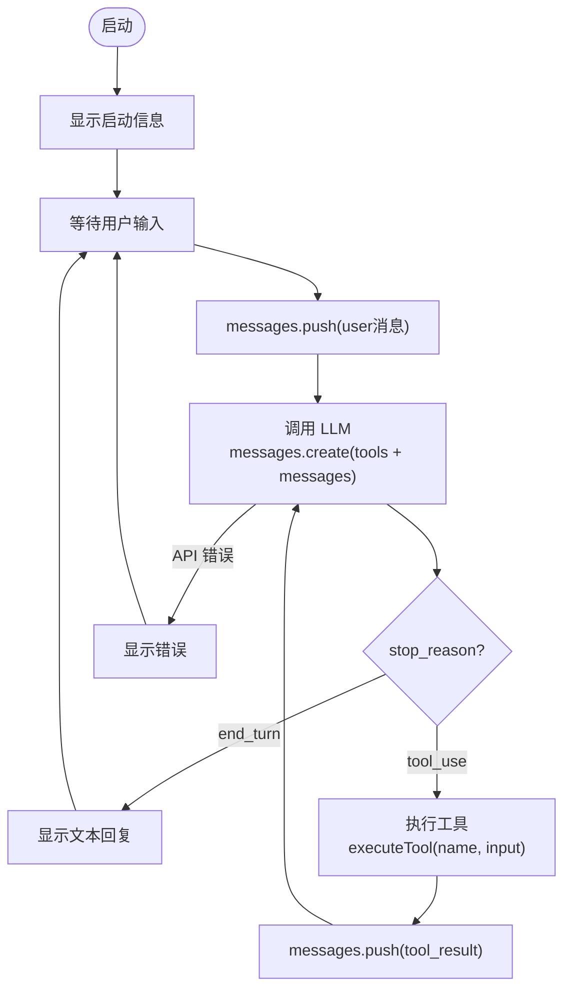

# Agent Demo

最小 AI Coding Agent 示例。

## 核心流程



每次调 LLM 都发送**完整的 messages 历史**。模型不记忆上次调用，靠 messages 保持上下文。

## 运行

```bash
cd agent-demo
npm install
```

在 `.env` 中配置：

```
ANTHROPIC_API_KEY=你的key
```

启动：

```bash
npm start
```

## 文件说明

| 文件 | 作用 |
|------|------|
| agent.mjs | 主循环（while + stop_reason 分支） |
| tools.mjs | 工具定义与执行 |
| config.mjs | 环境变量与 System Prompt |
| display.mjs | 终端状态显示 |
| logger.mjs | 日志（终端 + 文件） |
| messages.mjs | 消息管理与持久化 |

## 试试这些指令

- "列出当前目录的文件"
- "读取 package.json"
- "创建一个 hello.js 打印 hello world"
- "运行 node hello.js"
