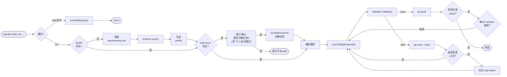
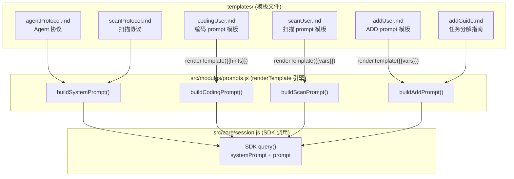
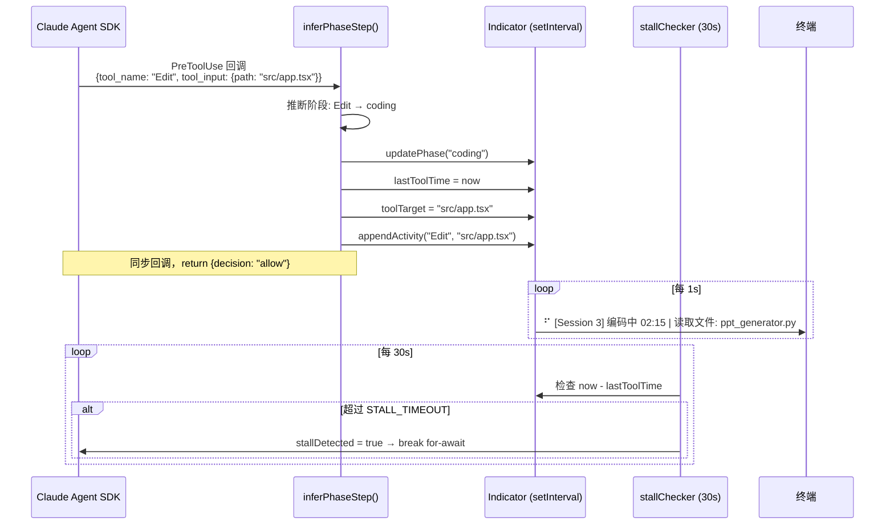

# Claude Coder — 技术架构文档

> 本文件面向开发者和 AI，用于快速理解本工具的设计、文件结构、提示语架构和扩展方向。

---

## 一句话定位

一个基于 Claude Agent SDK 的**自主编码 harness**：自动扫描项目 → 拆解任务 → 逐个实现 → 校验 → 回滚/重试 → 推送，全程无需人工干预。

---

## 0. 核心设计规则（MUST READ）

> 以下规则按重要性排序（注意力 primacy zone），所有代码修改和架构决策必须遵循。

### 规则 1：长 Session 不停工

Agent 在单次 session 中应最大化推进任务进度。**任何非致命问题都不应中断 session**。

- 缺少 API Key → 用 mock 或代码逻辑验证替代，记录到 `test.env`，继续推进
- 测试环境未就绪 → 跳过该测试步骤，完成其余可验证的步骤
- 服务启动失败 → 尝试排查修复，无法修复则记录问题后推进代码实现
- **长时间思考是正常行为**：模型处理大文件（如 500+ 行的代码文件）时可能出现 10-20 分钟的思考间隔，不代表卡死

**反面案例**：Agent 因 `OPENAI_API_KEY` 缺失直接标记任务 `failed` → 浪费整个 session

> Harness 兜底机制：当工具调用间隔超过 `SESSION_STALL_TIMEOUT`（默认 20 分钟）时自动中断 session 并触发 rollback + 重试。此阈值设计为远超正常思考时长，仅捕捉真正的卡死场景。

### 规则 2：回滚即彻底回滚

`git reset --hard` 是全量回滚，不做部分文件保护。

- 凭证文件（`test.env`、`playwright-auth.json`、`browser-profile/`）应通过 `.gitignore` 排除在 git 之外
- 如果回滚发生，说明 session 确实失败，代码应全部还原
- 不需要 backup/restore 机制 — 这是过度设计

### 规则 3：分层校验（fatal / recoverable / pass）

不是所有校验失败都需要回滚：

| 情况 | 有新 commit | 处理 |
|------|------------|------|
| session_result.json 格式异常 | 是 | **warn** — 代码已提交且可能正确，不回滚 |
| session_result.json 格式异常 | 否 | **fatal** — 无进展，回滚 |
| 代码结构性错误 | — | **fatal** — 回滚 |
| 全部通过 | — | **pass** — 推送 |

### 规则 4：凭证与代码分离

| 文件 | git 状态 | 说明 |
|------|---------|------|
| `test.env` | .gitignore | Agent 可写入发现的 API Key、测试账号 |
| `playwright-auth.json` | .gitignore | cookies + localStorage 快照（isolated 模式，`claude-coder auth` 生成） |
| `.runtime/browser-profile/` | .gitignore | 持久化浏览器 Profile（persistent 模式，`claude-coder auth` 生成） |
| `session_result.json` | git-tracked | Agent 每次 session 覆盖写入 |
| `tasks.json` | git-tracked | Agent 修改 status 字段 |

### 规则 5：Harness 准备上下文，Agent 直接执行

Agent 不应浪费工具调用读取 harness 已知的数据。所有可预读的上下文通过 prompt hint 注入（见第 5 节 Prompt 注入架构）。

### 规则 6：三层 Session 终止保护

SDK 的 `query()` 循环在模型产出**无 tool_use 的纯文本响应**时自动结束。但非 Claude 模型（GLM/Qwen/DeepSeek）可能不正确返回 `stop_reason: "end_turn"`，导致 SDK 继续发起新 turn 或模型陷入长时间思考。三层可配置的保护机制按优先级互补：

#### 第 1 层：完成检测（核心机制）

PostToolUse hook 监测模型对 `session_result.json` 的写入（Write 工具和 Bash 重定向）。检测到写入后，将超时从 20 分钟**缩短至 5 分钟**。模型在此窗口内未自行终止 → 自动中断。

**精准捕获「任务完成但 session 不终止」，不影响长时间自运行。**

#### 第 2 层：停顿检测（通用兜底）

每 30 秒检查最后一次工具调用时间。无工具调用 > `SESSION_STALL_TIMEOUT`（默认 1200 秒 / 20 分钟）→ 自动中断 session → runner 重试逻辑。

#### 第 3 层：maxTurns（仅 CI 推荐）

SDK 内置轮次计数。默认 0（无限制），仅 CI/pipeline 需要时启用。

| 配置项 | 环境变量 | 默认值 | 说明 |
|--------|---------|--------|------|
| 完成检测超时 | `SESSION_COMPLETION_TIMEOUT` | 300 秒 | session_result 写入后的宽限期 |
| 停顿超时 | `SESSION_STALL_TIMEOUT` | 1200 秒 | 长时间无工具调用 |
| 最大轮次 | `SESSION_MAX_TURNS` | 0（无限制） | 仅 CI 推荐 |

配置方式：`claude-coder setup` → 配置安全限制，或直接编辑 `.claude-coder/.env`。

---

## 1. 核心架构

```mermaid
flowchart TB
    subgraph Harness["bin/cli.js → src/core/runner.js (Harness 主控)"]
        direction TB
        scan["scanner.scan()<br/>首次扫描"]
        coding["session.runCodingSession()<br/>编码循环"]
        validate["validator.validate()<br/>校验"]
        indicator["Indicator 类<br/>setInterval 1s 刷新"]
    end

    subgraph SDK["Claude Agent SDK"]
        query["query() 函数"]
        hook_sys["PreToolUse hook<br/>hooks.js 工厂"]
    end

    subgraph Files["文件系统 (.claude-coder/)"]
        direction TB
        profile["project_profile.json<br/>tasks.json"]
        runtime["session_result.json<br/>progress.json"]
        phase[".runtime/<br/>phase / step / logs/"]
    end

    scan -->|"systemPrompt =<br/>CLAUDE.md + SCAN_PROTOCOL.md"| query
    coding -->|"systemPrompt = CLAUDE.md"| query

    query -->|PreToolUse 事件| hook_sys
    hook_sys -->|inferPhaseStep()| indicator

    query -->|Agent 工具调用| Files
    validate -->|读取| runtime
    validate -->|"pass → 下一 session<br/>fatal → rollback<br/>recoverable + commit → warn"| coding
```

**核心特征：**
- **项目无关**：项目信息由 Agent 扫描后存入 `project_profile.json`，harness 不含项目特定逻辑
- **可恢复**：通过 `session_result.json` 跨会话记忆，任意 session 可断点续跑
- **可观测**：SDK 内联 `PreToolUse` hook 实时显示当前工具、操作目标和停顿警告
- **自愈**：编辑死循环检测 + 停顿超时自动中断 + runner 重试机制
- **跨平台**：纯 Node.js 实现，macOS / Linux / Windows 通用
- **零依赖**：`dependencies` 为空，Claude Agent SDK 作为 peerDependency

---

## 2. 执行流程



---

## 3. 目录结构与模块职责

```
claude-coder/
├── bin/
│   └── cli.js                    # CLI 入口：参数解析、命令路由
├── src/
│   ├── index.js                  # 模块导出入口（预留，暂无实际用途）
│   ├── common/                   # 共享基础设施
│   │   ├── config.js             # .env 加载、模型映射、环境变量构建
│   │   └── indicator.js          # 终端进度指示器
│   ├── core/                     # 核心运行时
│   │   ├── runner.js             # Harness 主循环：scan → session → validate → retry/rollback
│   │   ├── session.js            # SDK query() 封装 + 日志流
│   │   ├── hooks.js              # Hook 工厂：完成检测 + 停顿检测 + 编辑防护
│   │   └── plan.js               # 计划生成模块
│   ├── modules/                  # 功能模块
│   │   ├── scanner.js            # 项目扫描：调用 runScanSession 生成 profile
│   │   ├── tasks.js              # 任务 CRUD + 状态机 + 进度展示
│   │   └── prompts.js            # 提示语构建：renderTemplate + 条件 hint
│   └── commands/                 # CLI 命令实现
│       ├── setup.js              # 交互式配置：模型选择、API Key、MCP 工具
│       ├── init.js               # 环境初始化：依赖安装、服务启动、健康检查
│       ├── auth.js               # Playwright 凭证：导出登录状态 + MCP 配置
│       └── validator.js          # 校验引擎：分层校验 + git 检查 + 测试覆盖
├── templates/                    # Prompt 模板目录
│   ├── agentProtocol.md          # Agent 协议（注入为 systemPrompt）
│   ├── scanProtocol.md           # 首次扫描协议（与 agentProtocol.md 拼接注入）
│   ├── addGuide.md               # 任务分解指南（ADD session 参考文档）
│   ├── codingUser.md             # 编码 session 用户 prompt 模板
│   ├── scanUser.md               # 扫描 session 用户 prompt 模板
│   └── addUser.md                # ADD session 用户 prompt 模板
└── design/                       # 设计文档
    ├── ARCHITECTURE.md           # 本文档
    ├── cli-architecture.md       # CLI 架构设计
    └── model-config-flow.md      # 模型配置传导链路
```

### 模块职责说明

| 模块 | 职责 |
|------|------|
| `bin/cli.js` | CLI 入口，解析命令行参数，路由到对应模块 |
| `src/common/config.js` | .env 文件解析、模型配置加载、环境变量构建 |
| `src/common/indicator.js` | 终端进度显示：spinner + 工具目标 + 停顿警告 |
| `src/core/runner.js` | Harness 主循环：scan → session → validate → retry/rollback |
| `src/core/session.js` | SDK query() 封装，支持多种 session 类型（coding/scan/add/simplify） |
| `src/core/hooks.js` | Hook 工厂：PreToolUse 拦截、PostToolUse 完成检测、停顿检测 |
| `src/core/plan.js` | 计划生成：需求 → 结构化方案文档 |
| `src/modules/scanner.js` | 项目扫描：技术栈识别、服务发现、文档收集 |
| `src/modules/tasks.js` | 任务管理：features 数组 CRUD、状态机、进度统计 |
| `src/modules/prompts.js` | Prompt 构建：模板渲染 + 动态 hint 注入 |
| `src/commands/setup.js` | 交互式配置向导：模型提供商选择、API Key 输入 |
| `src/commands/init.js` | 环境初始化：npm install、服务启动、健康检查 |
| `src/commands/auth.js` | Playwright 登录态导出：cookies + localStorage |
| `src/commands/validator.js` | 校验引擎：session_result 格式检查 + git 状态检查 |

---

## 4. 文件清单

### npm 包分发内容

| 文件 | 用途 |
|------|------|
| `bin/cli.js` | CLI 入口 |
| `src/index.js` | 模块导出入口（预留） |
| `src/common/config.js` | .env 加载、模型映射、环境变量构建 |
| `src/common/indicator.js` | 终端进度指示器 |
| `src/core/runner.js` | Harness 主循环 |
| `src/core/session.js` | SDK query() 封装 + 日志流 |
| `src/core/hooks.js` | Hook 工厂 |
| `src/core/plan.js` | 计划生成模块 |
| `src/modules/scanner.js` | 项目扫描 |
| `src/modules/tasks.js` | 任务 CRUD + 状态机 |
| `src/modules/prompts.js` | 提示语构建 |
| `src/commands/setup.js` | 交互式配置向导 |
| `src/commands/init.js` | 环境初始化 |
| `src/commands/auth.js` | Playwright 凭证持久化 |
| `src/commands/validator.js` | 校验引擎 |
| `templates/agentProtocol.md` | Agent 协议（系统 prompt） |
| `templates/scanProtocol.md` | 首次扫描协议 |
| `templates/codingUser.md` | 编码 session 用户 prompt 模板 |
| `templates/scanUser.md` | 扫描 session 用户 prompt 模板 |
| `templates/addUser.md` | ADD session 用户 prompt 模板 |
| `templates/addGuide.md` | 任务分解参考指南 |

### 用户项目运行时数据（.claude-coder/）

| 文件 | 生成时机 | 用途 |
|------|----------|------|
| `.env` | `claude-coder setup` | 模型配置 + API Key（gitignored） |
| `project_profile.json` | 首次扫描 | 项目元数据 |
| `tasks.json` | 首次扫描 | 任务列表 + 状态跟踪 |
| `progress.json` | 每次 session 结束 | 结构化会话日志 + 成本记录 |
| `session_result.json` | 每次 session 结束 | 当前 session 结果（扁平格式） |
| `playwright-auth.json` | `claude-coder auth`（isolated 模式） | 浏览器 cookies + localStorage 快照 |
| `.runtime/browser-profile/` | `claude-coder auth`（persistent 模式） | 持久化浏览器 Profile |
| `tests.json` | 首次测试时 | 验证记录（防止反复测试） |
| `.runtime/` | 运行时 | 临时文件（logs/、browser-profile/） |

---

## 5. Prompt 注入架构

### 架构图



### Session 类型与注入内容

| Session 类型 | systemPrompt | user prompt | 触发条件 |
|---|---|---|---|
| **编码** | agentProtocol.md | `buildCodingPrompt()` + 条件 hint | 主循环每次迭代 |
| **扫描** | agentProtocol.md + scanProtocol.md | `buildScanPrompt()` + profile 质量要求 | 首次运行 |
| **追加** | 精简角色提示（不注入 agentProtocol.md） | `buildAddPrompt()` + addGuide.md + session_result 格式 | `claude-coder add` 或 scan 后自动衔接 |

### 编码 Session 的条件 Hint

| # | Hint | 触发条件 | 影响 |
|---|---|---|---|
| 1 | `mcpHint` | MCP_PLAYWRIGHT=true | Step 5：可用 Playwright |
| 2 | `retryContext` | 上次校验失败 | 全局：避免同样错误 |
| 3 | `envHint` | 连续成功且 session>1 | Step 2：跳过 init |
| 4 | `testHint` | tests.json 有记录 | Step 5：避免重复验证 |
| 5 | `docsHint` | profile.existing_docs 非空或 profile 有缺陷 | Step 4：读文档后再编码 |
| 6 | `taskHint` | tasks.json 存在且有待办任务 | Step 1：跳过读取 tasks.json |
| 6b | `testEnvHint` | 始终注入 | Step 5：测试凭证提示 |
| 6c | `playwrightAuthHint` | MCP_PLAYWRIGHT=true | Step 5：Playwright 模式提示 |
| 7 | `memoryHint` | session_result.json 存在 | Step 1：上次会话摘要 |
| 8 | `serviceHint` | 始终注入 | Step 6：服务管理策略 |

---

## 6. 注意力机制与设计决策

### U 型注意力优化

agentProtocol.md 的内容按 LLM 注意力 U 型曲线排列：

```
顶部 (primacy zone)    → 铁律（约束规则）      → 最高遵循率
中部 (低注意力区)      → 参考数据（文件格式等） → 按需查阅
底部 (recency zone)    → 6 步工作流（行动指令） → 最高行为合规率
```

### 关键设计决策

| 决策 | 理由 |
|------|------|
| **静态规则 vs 动态上下文分离** | agentProtocol.md 是"宪法"（低频修改），hints 依赖运行时状态（动态生成） |
| **扫描协议单独文件** | 仅首次注入，编码 session 不需要，节省 ~2000 token |
| **任务分解指导在 user prompt** | 从系统 prompt 中部迁移到 user prompt（recency zone），提升遵循率 |
| **docsHint 动态注入** | profile.existing_docs 非空时，在 user prompt 提醒 Agent 读文档 |
| **prompts.js 模板分离** | 静态文本抽离到 templates/ 目录，prompts.js 仅负责变量计算和渲染 |

---

## 7. Hook 数据流

SDK 的 hooks 是**进程内回调**（非独立进程），零延迟、无 I/O 开销：



---

## 8. 相关文档

- [CLI 架构设计](./cli-architecture.md) — 入口设计、职责分离
- [模型配置传导链路](./model-config-flow.md) — .env 到 SDK 的完整路径
- [测试凭证持久化方案](../docs/PLAYWRIGHT_CREDENTIALS.md) — Playwright 登录态管理