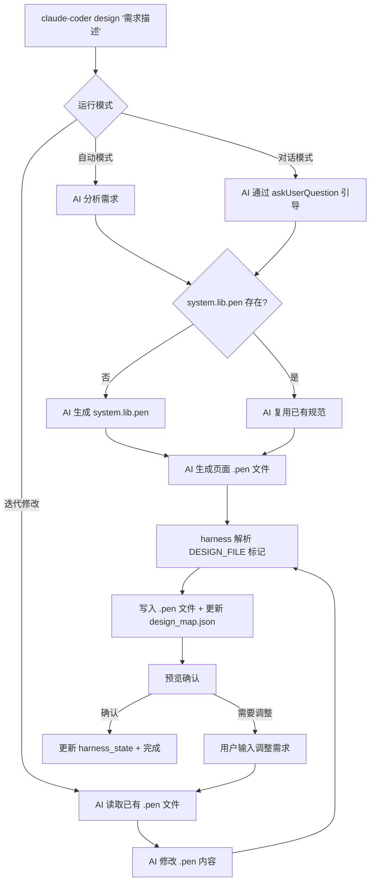

# UI Design Flow — 设计命令架构与联动方案

## 概述

`claude-coder design` 命令使用 Pencil 的 `.pen` 格式（纯 JSON）作为设计载体，AI 直接 Read/Write JSON 文件，无需 GUI 依赖。

`.pen` 是结构化的 JSON 对象树，AI 可精确理解：布局（`layout`/`gap`/`padding`）、文案（`content`）、样式（`fill`/`stroke`/`cornerRadius`）、组件复用（`reusable`/`ref`）、设计变量（`variables`/`themes`）。与截图不同，JSON 格式让 AI 能精确定位和修改任何元素。

## 核心决策

| 决策项 | 选择 | 理由 |
|--------|------|------|
| 设计格式 | Pencil `.pen` (JSON) | 纯 JSON 可被 AI 直接读写；格式公开、Git 友好 |
| 存放位置 | `.claude-coder/design/` | 与 harness 产物一致；可通过 `DESIGN_DIR` 环境变量覆盖 |
| 映射管理 | `design_map.json` 独立文件 | AI 生成内容与 harness_state 分离，出错可独立修复 |
| GUI 依赖 | 可选（非必须） | 生成和 plan/run 流程不依赖 Pencil；预览时可选安装插件 |

## 当前架构 (Phase 1 — design 命令)



## 文件结构

```
.claude-coder/
├── design/
│   ├── system.lib.pen        # 设计库（变量 + 可复用组件）
│   ├── design_map.json       # 设计映射表
│   └── pages/
│       ├── login.pen
│       └── dashboard.pen
├── .runtime/
│   └── harness_state.json    # design 字段存轻量指针
```

### design_map.json

```json
{
  "version": 1,
  "designSystem": "system.lib.pen",
  "pages": {
    "login": { "pen": "pages/login.pen", "description": "登录页面" }
  }
}
```

## AI 输出协议

AI 使用 DESIGN_FILE 标记输出设计文件，harness 的 `extractDesignFiles()` 解析并写入磁盘：

```
DESIGN_FILE path=system.lib.pen desc=设计规范
DESIGN_JSON_START
{"version":"2.9","variables":{...},"children":[...]}
DESIGN_JSON_END

DESIGN_FILE path=pages/login.pen desc=登录页面
DESIGN_JSON_START
{"version":"2.9","imports":{"sys":"../system.lib.pen"},"children":[...]}
DESIGN_JSON_END
```

---

## 后续联动方案

### Phase 2 — plan 命令联动

注入 `design_map.json` 路径，让 AI 自行探索并在任务中关联设计文件。

```javascript
function buildDesignHint() {
  if (!assets.exists('designMap')) return '';
  const designDir = assets.dir('design');
  return `项目已有 UI 设计文件，映射表: ${path.join(designDir, 'design_map.json')}。` +
    '请读取该文件了解可用的 .pen 设计文件，在生成任务时自行关联相关设计。';
}
```

### Phase 3 — run 命令联动

注入 design_map.json 路径，AI 编码时按需 Read .pen 文件理解布局和样式。

```javascript
function buildDesignHint() {
  if (!assets.exists('designMap')) return '';
  const designDir = assets.dir('design');
  return `如涉及 UI 实现，可读取 ${path.join(designDir, 'design_map.json')} 了解可用的 .pen 设计文件。` +
    '.pen 文件是 JSON 格式的 UI 设计描述，可直接用 Read 工具读取。';
}
```

### Phase 4 — go 命令集成

需求组装后可选自动生成 UI 设计：

```javascript
const shouldDesign = await promptProceedToDesign();
if (shouldDesign) {
  const { executeDesign } = require('./design');
  await executeDesign(config, goContent, opts);
}
```

### Phase 5 — Pencil 工具链集成（可选增强，2026-04 调研）

**核心结论**：.pen 的 JSON 格式对 AI 比截图更有价值。Pencil 上层工具的价值在于**人类预览**和**自动化验证**。

| 层级 | 工具 | 状态 |
|------|------|------|
| ① 纯 JSON 读写 | AI 直接 Read/Write .pen JSON，零外部依赖 | **当前使用** |
| ② Pencil CLI | `@pencil.dev/cli`，headless 导出截图/批量处理，需 Pencil 账号（免费） | 可选 |
| ③ Pencil IDE 插件 | Cursor/VSCode 安装后可视化预览 + 本地 MCP Server | 可选 |

**Pencil CLI 关键命令**：
```bash
pencil --in design.pen --export design.png    # 导出截图（不需 Anthropic Key）
pencil --out design.pen --prompt "创建登录页"   # AI 生成（需 Anthropic Key）
pencil interactive -o design.pen               # MCP 交互 shell
```

**IDE 插件 MCP 核心工具**：batch_design（增删改移）、get_screenshot（渲染截图）、snapshot_layout（检测溢出）、get_variables/set_variables（设计变量）。

> claude-coder 的 design 命令通过 Claude Agent SDK 独立运行，不会自动连接 IDE 插件 MCP。如需使用需在 `.mcp.json` 中配置。

> **OpenPencil ≠ Pencil.dev**：OpenPencil（@open-pencil/*）是独立的开源 Figma 替代品，可读 .pen 但不能写 .pen，原生格式为 .fig。

---

**参考**：[.pen 格式](https://docs.pencil.dev/for-developers/the-pen-format) · [CLI 文档](https://docs.pencil.dev/for-developers/pencil-cli) · [AI 集成](https://docs.pencil.dev/getting-started/ai-integration) · [Design Skill](https://github.com/chiroro-jr/pencil-design-skill)
