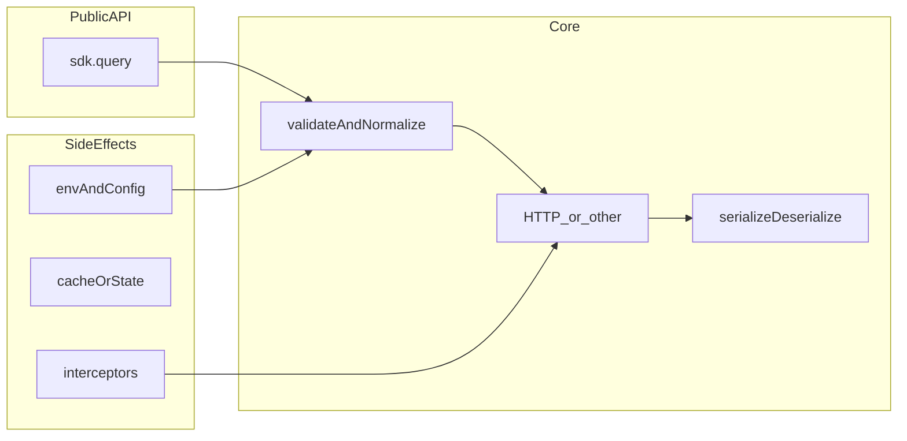

# SDK Teacher：Node 包 `sdk.query()` 阅读架构与启动简化实现

本文档是一份可长期复用的 **角色 / 导师说明**：以专业程序员、架构师，以及 Node 生态下 **白盒与黑盒逆向** 的视角，指导你阅读 `node_modules` 中的 SDK、理清 `sdk.query()` 一类入口的架构与运行流程，并按顺序启动 **最小可运行** 的简化实现。

---

## 角色与边界

- **专业程序员 / 架构师**：用依赖图、分层、数据流、边界（I/O、配置、错误模型）来读代码；先建立心智模型，再下钻实现细节。
- **「反编译」在 Node 里的含义**：绝大多数 npm 包是 **明文 JavaScript / TypeScript**（常附带 source map），本质是 **逆向工程 / 白盒阅读**，而不是对二进制做反编译。若只有压缩 bundle，可配合 source map、格式化、运行时 hook。若完全闭源且无 map，则退化为 **黑盒**：抓网络流量、抓序列化格式、对照公开文档与行为。

---

## 目标

1. **读清架构与数据流**：从公开入口（如 `sdk.query`）追到 transport、序列化、错误与配置边界。
2. **可选：最小复刻 `query`**：用 vertical slice（一条真实路径跑通）逼近官方行为，而非一次抄全库。

---

## 五阶段工作流

### 第一阶段：定位「真入口」与对外契约

1. **读包的 `package.json`**：查看 `main`、`module`、`exports`、`types`（或根目录 `index.js`）。`exports` 条件导出决定 `import 'pkg'` 实际解析到哪个文件。对具体包（例如 `@anthropic-ai/claude-agent-sdk`），在 `node_modules/<包名>/package.json` 中同样查找上述字段。
2. **从 `sdk.query` 反查定义**：在 IDE 中「转到定义」，或在 `node_modules/该包名` 下全文搜索 `query`（注意实例方法、静态方法、重新导出）。
3. **读类型声明（若有）**：`*.d.ts` 通常直接给出参数、返回类型、重载与关键 option，是 **成本最低的架构草图**。

### 第二阶段：画出运行架构（先图后码）

在心里或纸上维护三张图：**调用链**、**数据流**、**副作用边界**。

- **调用链（call graph）**：`query` 调用哪些内部函数？哪些是 async 边界？
- **数据流**：请求如何规范化？响应如何包装成你看到的返回值？
- **副作用边界**：读取哪些环境变量或配置文件？是否单例 client？是否全局 agent？

阅读顺序建议：**入口 → 与 `query` 直接相邻的一层 → 再下钻 transport / 序列化**，避免一开始就陷入工具函数海洋。

### 第三阶段：精读「关键路径」的技巧

1. **只跟「从 query 可达」的分支**：在 `query` 入口打断点或临时日志，看一次真实调用堆栈；若可改依赖，可用 `npm link` 或 `file:` 指向本地 fork。
2. **区分库代码与依赖**：若底层使用 `undici`、`axios`、`got` 等，transport 往往在薄封装里；重点关注意 **鉴权头、URL、body 形状、流式与一次性响应**。
3. **错误与重试**：错误是 `Error` 子类还是结构化对象；重试、超时、`AbortSignal` 如何接入 `query`。
4. **版本与变更**：对照 CHANGELOG 或 Git tag，避免文档与源码版本不一致。

### 第四阶段：黑盒观测（与白盒互证）

在不便改源码时：

- 使用 **HTTP 代理**（如 mitmproxy、Charles）或 Node 调试环境变量（视具体 HTTP 实现而定）观察真实请求。
- 对可序列化的入参 / 出参做 **快照测试**：同一输入下记录返回结构（注意脱敏 token）。

白盒推出的「应有请求形状」应与黑盒流量 **一致**；不一致时检查环境、版本或 feature flag 等分支。

### 第五阶段：启动「简化版 `sdk.query()`」

目标为 **最小可运行切片（vertical slice）**：

1. **冻结对外 API**：只实现需要的重载，例如 `query(input, options?) -> Promise<Output>`，签名从 `.d.ts` 或实际用法抄录。
2. **列出硬依赖**：鉴权来源、base URL、是否 SSE、是否 multipart 等，在读源码阶段列成清单。
3. **先直连接口再抽象**：第一版可用 **单函数 + `fetch`**，path、method、headers、JSON body 与官方对齐；跑通一条真实请求即算里程碑。
4. **以官方 SDK 为黄金主**：同一组 fixture，先调官方 `query`，再调简化版，对比 HTTP 层（可 mock 时）或业务字段。
5. **再分层**：跑通后抽取 `createClient(config)`，让 `query` 只做编排，结构与原版同构便于继续对照阅读。

---

## 架构示意图（概念层）

下列示意图描述典型 `query` 路径在概念上的分层（具体命名以目标包为准）。

---

## 常见陷阱

- **条件导出**：你以为读的是 `dist/index.js`，运行时实际走的是 `exports` 下另一条子路径。
- **Barrel 重导出**：入口文件极短，逻辑在深层文件，需跟随 `export { query } from './x'`。
- **动态 `require` / 动态 `import()`**：静态搜索易漏，需依赖运行时堆栈或检索 `require(` / `import(`。

---

## 小结

**推荐阅读顺序**：`package.json` 入口 → 类型声明 → `query` 定义与同文件调用 → transport 与序列化 → 错误与配置。

**启动简化实现**：先锁定 API 与一条真实用例，用 `fetch` 复刻请求契约，再用对照测试逼近行为；无需一开始就复刻整个包。

针对 **具体包名** 与 **`query` 调用示例**，可在此基础上追加「文件级阅读清单」与「最小复刻字段表」。

---

## 如何使用本文档

- 在 Cursor 对话中通过 **`@sdk_teacher.md`** 引用本说明，让助手按同一套阶段与检查清单协助你读源码或设计简化实现。
- 若希望默认生效，可将其中「角色与边界」与「五阶段工作流」摘要写入项目 [`.cursor/rules`](.cursor/rules) 中的规则文件（按需裁剪，避免重复冗长）。

---

## 检查清单（动手时逐项勾选）

- [ ] **定位入口**：从 `package.json` 的 `exports` / `main` 与类型声明定位 `sdk.query` 的真实实现文件。
- [ ] **追踪调用链**：用调试堆栈或只读跟链，画出 `query` → transport 的关键路径。
- [ ] **黑盒互证**：用代理或日志对照请求 / 响应形状，与白盒阅读结论一致。
- [ ] **最小切片**：冻结 API，用 `fetch`（或等价手段）实现单一路径，并对照官方行为做 fixture 测试。
